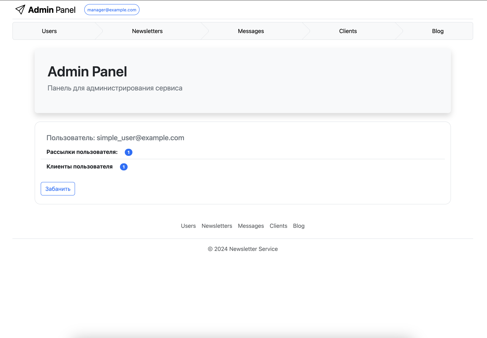

# Newsletters Sevice

### # Сервис для рассылки email сообщений.

- Пользователь добавляет своих клиентов в базу данных

- Пользователь добавляет сообщения для рассылок

- Пользователь создает рассылки, выбрав нужных клиентов и сообщения

- Периодичность: единоразовая, ежедневная, еженедельная и ежемесячная
- Рассылку можно приостанавливать (кроме единоразовых рассылок) и
вновь запускать через некоторое время, если нужно

### # Установка
- Клонируйте репозиторий
- Создайте виртуальное окружение:
`python -m venv .venv`
- Установите зависимости:
`pip install -r requirements.txt`
- Для работы приложения необходимо установить: postgres, redis

### # Перед запуском

- Перед запуском проекта переименуйте файл `env_template` в 
`.env `и поменяйте содержимое на свои переменные окруженния

- Выполните миграцию `python manage.py migrate`

- Создайте суперпользователя (имеет все права) `python manage.py create_custom_super_user`

_Логин: admin@example.com Пароль: 1234_

- Создайте менеджера приложения: `python manage.py create_moderator_user`

_(может: просматривать любые рассылки, просматривать список пользователей сервиса, блокировать пользователей сервиса,_
_отключать рассылки)_

_Логин: manager@example.com Пароль: 0987_

- Создайте простого пользователя: `python manage.py create_simple_user`

_Логин: simple_user@example.com Пароль: qwerasdf_

Заполните базу даных (блог): `python manage.py loaddata blog_data.json`

### # Обратите внимание

- Запуск всех рассылок в ручном режиме: `python manage.py run_all_newsletters`
- Настройте в `config.settings` параметр `AUTORUN_SCHEDULER` для автоматического включения планировщика рассылок